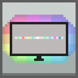

# Alight

Проект живой подсветки монитора, который включает в себя прошивку для ардуино и приложение для управления светодиодной лентой.

---

## Компоненты и схема подключения

Для организации подсветки использовались следующие компоненты:

- Arduino Nano
- Адресная светодиодная лента (плотность: 60 светодиодов на метр)
- Блок питания на 3 ампера?

## Управление подсветкой
...
